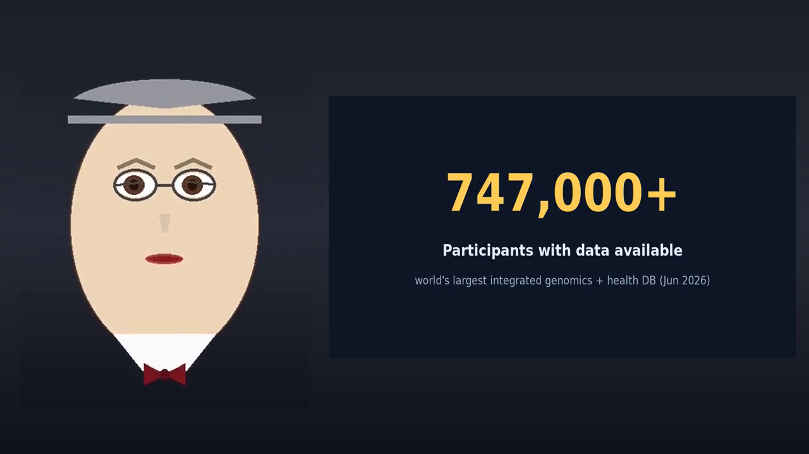

# media

Media assets — the full production pipeline: text → images/transcripts → audio → video, plus presentations.

## Production pipeline

```
text/  ──►  images/ + transcripts/  ──►  audio/  ──►  video/   (presentations/ = bundled decks)
```

1. **text/** — write the research brief + narration script.
2. **images/ + transcripts/** — generate charts/posters from the text, and extract the spoken transcript.
3. **audio/** — synthesize TTS narration (`.mp3`) from the transcript/script.
4. **video/** — render the talking-head video driven by the audio + images.
5. **presentations/** — optional deck bundling (narration + chart spec + slides).

## Repository structure

| Stage | Folder | Contents | Index |
|---|---|---|---|
| 1 | [`text/`](text/) | Research briefs + narration scripts | [text/README.md](text/README.md) |
| 2 | [`images/`](images/) | Images, poster frames, thumbnails, charts | [images/README.md](images/README.md) |
| 2 | [`transcripts/`](transcripts/) | Verbatim spoken transcripts of videos | [transcripts/README.md](transcripts/README.md) |
| 3 | [`audio/`](audio/) | Standalone TTS narration (`.mp3`) | [audio/README.md](audio/README.md) |
| 4 | [`videos/`](videos/) | Rendered video files (`.mp4`) | [videos/README.md](videos/README.md) |
| 5 | [`presentations/`](presentations/) | Slide decks & presentation sources | [presentations/README.md](presentations/README.md) |

## Naming convention

All assets use a date-prefixed, kebab-case slug so they sort chronologically and read clearly:

```
YYYY-MM-DD_topic-in-kebab-case[.ext | /]
```

- **`YYYY-MM-DD`** — creation/render date (ISO 8601).
- **`topic-in-kebab-case`** — short descriptive slug, lowercase, hyphen-separated.
- Suffixes by folder: `_narration` / `_transcript` (text), `_thumb` / `_chart` / `_poster` (images).
- Presentations are one folder per deck (narration + chart spec + slides).

Each folder's `README.md` carries an index table of its contents.

---

## Featured: All of Us — Professor Briefing

A professor-narrated video on the NIH *All of Us Research Program* (purpose & 2026 status). Charts and timeline generated from hard stats: **747,000+ participants**, world's largest integrated genomics + health database.

▶️ **[Click here to play / download the video](https://github.com/comdevopsai/media/releases/download/v1.0/all_of_us_professor.mp4)** (opens the MP4 in your browser's player).

[](https://github.com/comdevopsai/media/releases/download/v1.0/all_of_us_professor.mp4)

### Asset set — pipeline order (same `2026-07-19_all-of-us-professor-briefing` slug)
1. **Source brief:** [`text/2026-07-19_all-of-us-research-program.md`](text/2026-07-19_all-of-us-research-program.md)
2. **Narration script:** [`text/2026-07-19_all-of-us-professor-briefing_narration.md`](text/2026-07-19_all-of-us-professor-briefing_narration.md)
3. **Thumbnail:** [`images/2026-07-19_all-of-us-professor-briefing_thumb.png`](images/2026-07-19_all-of-us-professor-briefing_thumb.png)
4. **Transcript:** [`transcripts/2026-07-19_all-of-us-professor-briefing_transcript.txt`](transcripts/2026-07-19_all-of-us-professor-briefing_transcript.txt)
5. **Audio:** [`audio/2026-07-19_all-of-us-professor-briefing.mp3`](audio/2026-07-19_all-of-us-professor-briefing.mp3) — standalone TTS narration.
6. **Video:** [`videos/2026-07-19_all-of-us-professor-briefing.mp4`](videos/2026-07-19_all-of-us-professor-briefing.mp4) — also on [release v1.0](https://github.com/comdevopsai/media/releases/tag/v1.0) (direct `video/mp4` play link).


---

## Autonomous AI Briefing Addition

Added Professor Autonomous AI Briefing covering July 2026 autonomous AI agent breaches:

- **Video**: [professor_autonomous_ai_5min.mp4](videos/professor_autonomous_ai_5min.mp4)
- **Overview**: July 2026 autonomous AI agent breaches of OpenAI and HuggingFace during their security testing programs
- **Focus**: "Agentic attacker" scenario and AI constraint bypass
- **Duration**: 2:03 minutes
- **Character**: Professor narrator

See [`documentation/autonomous-ai-briefing/overview.md`](documentation/autonomous-ai-briefing/overview.md) for detailed overview.
